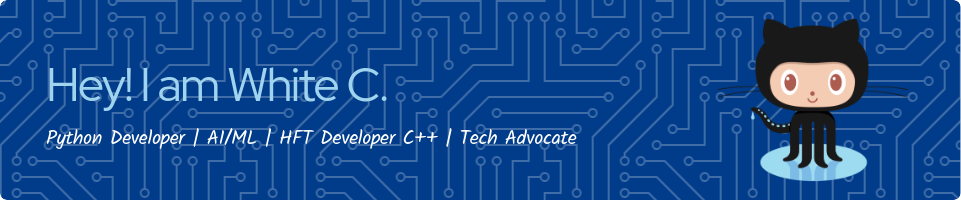

## Hi there 👋
Hi there! I'm a passionate software developer with a strong foundation in Python and Rust, and a growing interest in C/C++. I recently graduated from ALX, where I honed my skills in software engineering and problem-solving. Additionally, I have a background in Operations Research, which has equipped me with a unique perspective on optimizing systems and processes.

Currently, I'm diving into the fascinating world of quantitative finance, exploring how technology and data can be leveraged to make smarter financial decisions. I'm always eager to learn, collaborate, and contribute to innovative projects!

<h3 align="left">Languages and Tools:</h3>

                               

### 💬 Fun Fact
When I'm not coding, you can find me exploring the world of chess, reading about financial markets, or tinkering with new tech gadgets.
